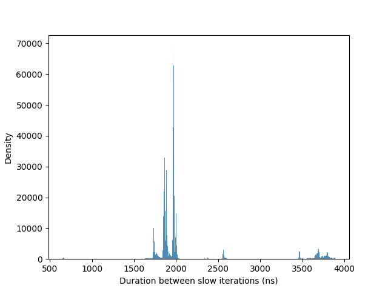
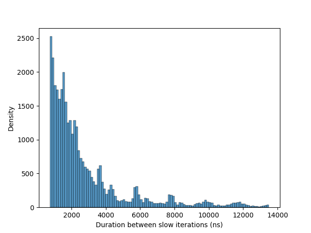

# Rapport Performance

## Informations sur la machine

Les mesures ont ete faites sur mon Lenovo ThinkPad P1 G6. La machine possede 3 niveaux de cache :

| Niveau | Taille |
|---|---:|
| L1 | 64 KiB |
| L2 | 2 MiB |
| L3 | 24 MiB |

La taille d'une ligne de cache est de 64 bytes.

Remarque importante : sur ma machine, `perf` separe certains compteurs entre `cpu_core` et `cpu_atom`. Pour les ratios, j'ai donc utilise principalement les valeurs `cpu_core`, qui representent la majorite des evenements mesures dans mes executions.

## Experience 1 : prediction d'embranchements

Cette experience compare le meme traitement sur des donnees non triees et triees.

| Cas | Commande | Temps mesure par le programme | Temps total `perf` | Branches `cpu_core` | Branch misses `cpu_core` | Ratio `branch-misses / branches` |
|---|---|---:|---:|---:|---:|---:|
| Donnees non triees | `./branch-misprediction 0` | 2925 ms | 3.143 s | 883'738'848 | 210'185'095 | 23.8 % |
| Donnees triees | `./branch-misprediction 1` | 318 ms | 1.396 s | 1'804'002'254 | 38'275'173 | 2.1 % |

Ce qui a marche : cette experience montre clairement l'effet attendu. Avec les donnees non triees, le processeur se trompe beaucoup plus souvent dans la prediction des branches. Le taux de mauvaises predictions est d'environ **23.8 %**, contre seulement **2.1 %** avec les donnees triees.

L'explication est que le test `if (memory[j] < value)` devient beaucoup plus previsible quand les valeurs sont triees. Le processeur peut alors mieux anticiper le resultat du branchement. Sur les donnees non triees, le resultat du `if` change de maniere moins reguliere, ce qui provoque plus de mauvaises predictions et donc plus de pertes de temps.

La question StackOverflow "Why is it faster to process a sorted array than an unsorted array?" a beaucoup d'upvotes parce que le resultat est contre-intuitif au debut : on ne change presque pas l'algorithme, mais l'ordre des donnees suffit a changer fortement les performances.

## Experience 2 : latences de la SDRAM

Ce qui a marche : le programme a bien produit des mesures et les histogrammes montrent des pics. On voit notamment des valeurs autour de quelques microsecondes.

Ce qui n'a pas vraiment marche : je n'obtiens pas un pic clair autour de **7.8 us**, qui correspond a l'intervalle classique de rafraichissement souvent cite pour la DRAM. Mes graphes montrent plutot des pics autour de **1.8 us a 4 us**, et un deuxieme graphe beaucoup plus disperse avec des valeurs qui montent vers **10 us a 14 us**.

Je ne peux donc pas affirmer que mes resultats confirment proprement le comportement theorique du rafraichissement memoire. La correspondance avec la theorie est seulement partielle : on observe bien des acces plus lents de maniere periodique ou repetee, mais pas avec une periode propre et facile a identifier.

Les causes probables sont :

- le fait que la machine utilise des coeurs hybrides (`cpu_core` / `cpu_atom`) ;
- les optimisations et comportements internes du controleur memoire ;
- le fait que l'experience est tres sensible a l'environnement d'execution.

Conclusion pour cette experience : elle a permis de voir qu'il existe des latences memoire anormales, mais elle n'a pas donne une demonstration propre du rafraichissement DRAM a 7.8 us.

## Experience 3 : false sharing

Mes mesures principales avec 3 threads sont les suivantes :

| Threads | Increment | Temps programme | Temps total `perf` | Observation |
|---:|---:|---:|---:|---|
| 3 | 1 | 32 ms | 0.0346 s | Cas qui devrait provoquer du false sharing |
| 3 | 8 | 31 ms | 0.0338 s | Cas qui devrait eviter le false sharing |

Ce qui etait attendu : avec `increment = 1`, les threads travaillent sur des elements proches en memoire. Comme une ligne de cache fait 64 bytes et qu'un `size_t` fait 8 bytes, plusieurs elements se trouvent sur la meme ligne de cache. Les coeurs doivent alors se renvoyer la ligne de cache, ce qui devrait ralentir le programme. Avec `increment = 8`, les elements sont separes d'une ligne de cache complete, donc le false sharing devrait etre evite.

Ce qui n'a pas marche : mes mesures ne montrent presque aucune difference entre `increment = 1` et `increment = 8`. Le temps reste autour de **31-32 ms**, donc je n'arrive pas a mettre en evidence le false sharing avec ces resultats.

Les raisons possibles sont :

- les threads n'etaient pas fixes sur des coeurs precis ;
- `perf` donne des compteurs separes entre `cpu_core` et `cpu_atom`, ce qui rend l'analyse moins claire ;
- les optimisations du compilateur et le comportement du processeur peuvent masquer l'effet attendu.

Conclusion pour cette experience : le principe theorique du false sharing est clair, mais mes mesures ne le demontrent pas correctement. 

## Experience 4 : cache locality

Le programme remplit une matrice puis calcule une somme. Il existe deux versions :

- `locality-line` parcourt la matrice par ligne ;
- `locality-col` parcourt la matrice par colonne.

Comme la matrice est stockee en memoire de maniere lineaire, le parcours par ligne devrait normalement etre plus efficace. Il lit des elements contigus, ce qui profite mieux aux lignes de cache. Le parcours par colonne saute plus loin en memoire a chaque acces, ce qui devrait causer plus de cache misses.

Mes resultats :

| N | Parcours | Somme calculee | Temps d'acces | Cache references `cpu_core` | Cache misses `cpu_core` |
|---:|---|---:|---:|---:|---:|
| 1000 | row-major | 499999500000 | 0.000209 s | 210'661 | 34'870 |
| 1000 | column-major | 499999500000 | 0.000208 s | 151'336 | 28'968 |
| 2000 | row-major | 7999998000000 | 0.001241 s | 658'284 | 513'398 |
| 2000 | column-major | 7999998000000 | 0.001189 s | 596'676 | 470'388 |
| 5000 | row-major | 312499987500000 | 0.007375 s | 3'387'410 | 2'870'120 |
| 5000 | column-major | 312499987500000 | 0.007441 s | 3'191'503 | 2'727'624 |
| 10000 | row-major | 4999999950000000 | 0.028976 s | 12'643'413 | 10'722'331 |
| 10000 | column-major | 4999999950000000 | 0.029351 s | 12'889'330 | 10'965'760 |

Ce qui a marche : les deux versions donnent la meme somme, donc elles parcourent bien les memes donnees.

Ce qui n'a pas vraiment marche : les mesures ne montrent pas une grosse difference entre le parcours par ligne et le parcours par colonne. Pour `N = 10000`, le parcours par colonne est seulement un peu plus lent, mais l'effet reste faible. Pour les plus petites tailles, les differences sont meme presque nulles.

Normalement, le parcours par ligne devrait etre meilleur parce qu'il exploite mieux la localite spatiale du cache. Dans mes resultats, l'effet attendu est donc seulement tres legerement visible, surtout pour les grandes valeurs de `N`.

Les raisons possibles sont :

- les mesures sont trop courtes et donc sensibles au bruit ;
- il manque des repetitions pour lisser les resultats ;
- le compilateur optimise fortement le code ;
- le prefetching du processeur peut cacher une partie du cout ;
- les compteurs `perf` ne sont pas tres simples a interpreter sur cette machine.

Conclusion pour cette experience : le concept de cache locality est compris, mais mes mesures ne le mettent pas en evidence de maniere tres forte.

## Conclusion personnelle

Ce laboratoire montre que les performances d'un programme ne dependent pas seulement de l'algorithme visible dans le code. Le processeur, les caches, la prediction d'embranchements, la memoire et l'organisation des donnees jouent aussi un role important.

Les autres experiences ont ete moins concluantes dans mes mesures. La latence DRAM a donne des graphes bruites, le false sharing n'a pas montre la difference attendue, et la cache locality n'a montre qu'un effet faible. Ce n'est pas inutile : cela montre aussi qu'une experience de performance est difficile a realiser correctement. 

Pour la programmation concurrente, ces notions sont importantes. Ajouter des threads ne garantit pas de meilleures performances. Si plusieurs threads modifient des donnees proches en memoire, le false sharing peut ralentir le programme. Si les donnees sont mal organisees, les caches sont moins efficaces. Si le code contient des branches difficiles a predire, le processeur perd du temps.

Les bonnes pratiques sont donc de garder les donnees souvent utilisees proches en memoire, d'eviter les partages inutiles entre threads, de separer les donnees modifiees par plusieurs coeurs, de mesurer plusieurs fois, et de verifier les resultats avec des outils comme `perf`. Ce labo m'a surtout appris que les performances doivent etre mesurees avec prudence : parfois l'effet attendu apparait clairement, et parfois la machine reelle rend les resultats beaucoup plus difficiles a interpreter.
